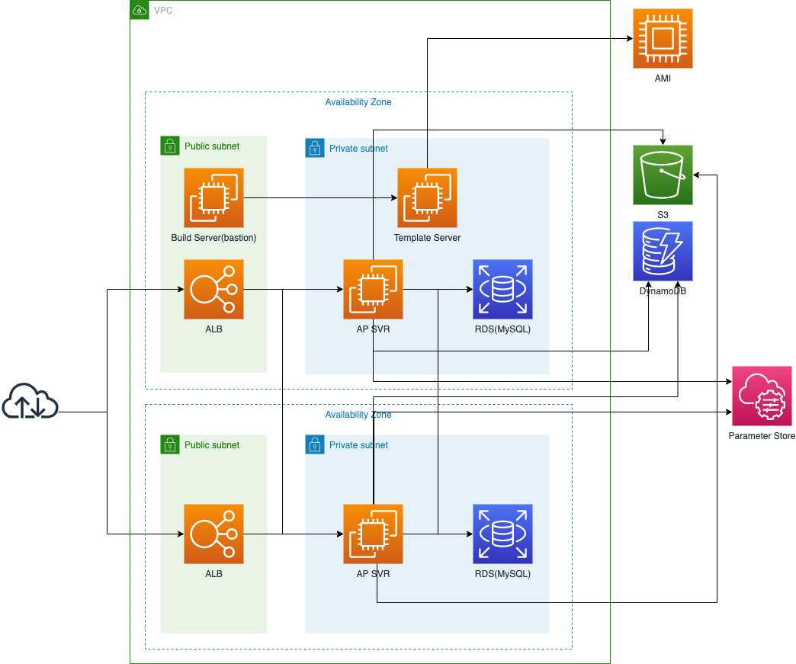

# System structure


# インフラの構築
1. Cloud 9を立ち上げる

2. 以下のリポジトリをClone  
`git clone https://github.com/cupperservice/hj-sample-infra.git`

    ディレクトリ構成
    ```
    +-- common   -> terraform definition files
    +-- staging  -> parameters for staging environment
    ```

3. 各種パラメータの設定
    * ファイル：`hj-sample-infra/staging/main.tf`

4. terraformを実行  
`staging` の下で以下を実行する
    ```
    terraform init
    terraform plan
    terraform apply
    ```

5. rdsのエンドポイントを登録する  
    1. `staging/main.tf` の `database/host` に作成したrdsのエンドポイントを設定する
    2. 適用する  
    `terraform apply`

# bastionサーバの構築
[Cloud9からbastionサーバにssh接続する](#how-to-ssh-login)

1. 以下のリポジトリをcloneする  
`git clone https://github.com/cupperservice/hj-sample-app.git`

2. templateサーバにリソースをコピーする  
`rsync -tav hj-sample-app/ ec2-user@TemplateサーバのPrivate IPアドレス:/opt/appsvr/`

# テーブルの作成
bastionサーバで作業する
1. templateサーバにSSHトンネリングを確立する
`ssh -L 3306:RDSのエンドポイント:3306 ec2-user@templateサーバのPrivate IPアドレス`

2. RDSに接続する
`mysql -uユーザID -pパスワード -h127.0.0.1 mydb`

3. 以下のSQLを実行する
```
CREATE TABLE user (
  id          INTEGER      AUTO_INCREMENT,
  user_id     VARCHAR(50)  NOT NULL UNIQUE,
  password    VARCHAR(100) NOT NULL,
  name        VARCHAR(100) NOT NULL,
  PRIMARY KEY (id)
);

CREATE TABLE image (
  id          INT          NOT NULL AUTO_INCREMENT,
  name        VARCHAR(100) NOT NULL UNIQUE,
  size        INT          NOT NULL,
  comment     VARCHAR(100) NOT NULL,
  PRIMARY KEY (id)
);
```

# templateサーバの構築
bastionサーバからtemplateサーバにssh接続する  
`ssh ec2-user@templateサーバのPrivate IPアドレス`

1. regionを設定する
以下のコマンドを実行する  

    ```
    aws configure
    ```
    `Default region name` に `us-east-1` を設定する  
    `Default region name` 以外は空 Enter

2. アプリケーションの初期化  
以下のコマンドを `/opt/appsvt` の下で実行する  
`npm install`

2. 環境変数の設定  
以下の環境変数を設定する

    | name                    | value        |
    |:------------------------|:-------------|
    |DB_HOST                  |RDSのEndpoint |
    |DB_PORT                  |main.tfの定義値|
    |DB_NAME                  |main.tfの定義値|
    |DB_USERNAME              |main.tfの定義値|
    |DB_PASSWORD              |main.tfの定義値|
    |S3_BUCKET_NAME_ORIGINAL  |main.tfの定義値|
    |S3_BUCKET_NAME_THUMBNAIL |main.tfの定義値|
    |SESSION_KEY_NAME         |main.tfの定義値|
    |SESSION_TABLE_NAME       |main.tfの定義値|

    __#####################################__  
    環境変数の設定方法  
    `export 環境変数名=値`  
    __#####################################__  

3. ユーザの登録
    1. 登録するユーザーを編集  
    `tool/user.csv` を編集する
    2. 登録
    `tool`の下で以下を実行する  
    `node add_user.js user.csv`

4. 疎通確認
    1. アプリケーションサーバを起動  
    `npm run start`
    2. 一時的に外部からアクセスできるようにtemplateサーバのSecurity Groupの8080ポートを設定する
    3. ブラウザからtemplateサーバの8080ポートにアクセスして動作することを確認する

5. 起動スクリプトの作成
    1. `scripts/app.service` を `/etc/systemd/system/app.service` にコピーする
    2. 定義をリロードする  
    `sudo systemctl daemon-reload`
    3. 起動  
    `sudo systemctl start app`
    4. ブラウザからtemplateサーバの8080ポートにアクセスして動作することを確認する
    5. 自動起動設定  
    `sudo systemctl enable app`

6. イメージ作成  
  templateサーバのイメージを作成する

# アプリケーションサーバを立ち上げる
1. `staging/main.tf` の以下を編集する
    * `app/image_if` -> 作成したイメージのID
    * `app/max_size` -> 1
    * `app/min_size` -> 1
2. 適用する  
  `terraform apply`

# 動作確認
WebブラウザからLoad BalancerのDNS nameにアクセスしてアプリケーションが正常に動作していることを確認する

---
# <a id="how-to-ssh-login">Cloud9からbastionサーバにsshログインする</a>
1. 秘密鍵(labsuser.pem)をCloud9上にコピー

2. 秘密鍵のパーミッションを変更  
`chmod 0400 labsuser.pem`

3. `ssh agent` を起動する  
`eval $(ssh-agent)`

4. ssh agent に鍵を登録する  
`ssh-add labsuser.pem`

5. ssh接続  
`ssh -A ec2-user@bastionサーバのPublic IPアドレス`
